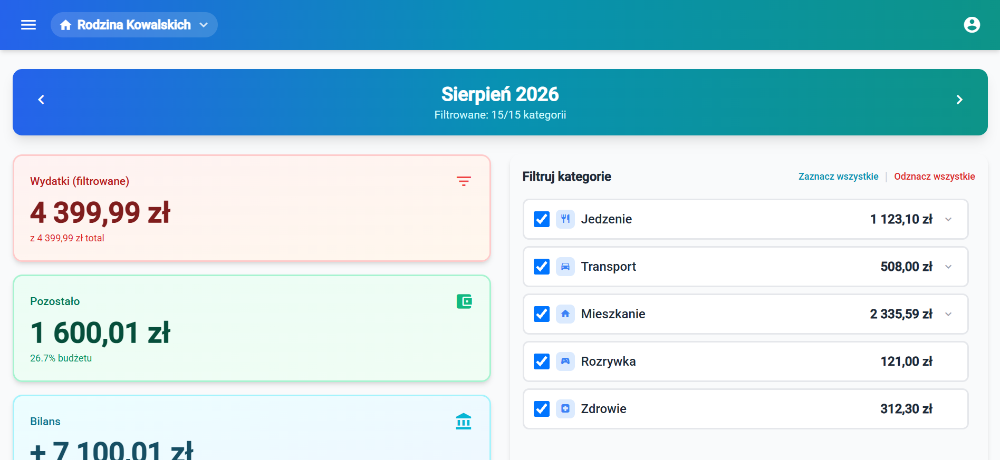

# ShoppingHours

**Wspólny budżet domowy bez arkusza kalkulacyjnego.**

ShoppingHours to aplikacja śledzenia kosztów życia: dla rodzin, par i współlokatorów.

## Co dostajesz

- 🏠 **Gospodarstwa domowe**: osobna przestrzeń na wspólne wydatki dla każdego "projektu życiowego" (mieszkania, wyjazdu, rozliczeń z rodziną). Możesz należeć do kilku naraz.
- 💸 **Wydatki dzielone między domownikami**, z kategoriami i podkategoriami, filtrami i pełną historią.
- 📊 **Budżety**: ustaw limit na całe gospodarstwo albo pojedynczą kategorię i miej oko na to, ile zostało.
- 💰 **Przychody**, osobno od wydatków, żeby na panelu głównym od razu zobaczyć realny bilans miesiąca.
- 👥 **Role i uprawnienia**: właściciel, członek, gość, każdy widzi i może dokładnie tyle, ile powinien.
- 🔒 **Bezpieczeństwo na poważnie**: dostęp tylko z zaproszenia, opcjonalne uwierzytelnianie dwuetapowe (2FA), zero otwartej rejestracji.

## Dla kogo to jest

Jeśli mieszkasz z kimś i wspólnie płacicie rachunki, dzielicie się zakupami albo planujecie budżet na wyjazd, to jest dokładnie to narzędzie.

## Jak zacząć

Dostęp działa wyłącznie na zaproszenie: poproś administratora aplikacji o link, załóż konto w 2 minuty i jesteś w środku.

Pełny, szczegółowy przewodnik krok po kroku (z opisem każdej funkcji i zrzutami ekranu) znajdziesz w **[README.md](README.md)**.
