# ShoppingHours: przewodnik użytkownika

Witaj w ShoppingHours! To aplikacja do wspólnego zarządzania domowym budżetem, pozwala śledzić wydatki, dzielić je między domownikami, organizować je w kategorie i mieć pełny wgląd w to, na co idą pieniądze w Twoim gospodarstwie domowym.

Ten przewodnik zakłada, że widzisz aplikację pierwszy raz. Przeprowadzi Cię krok po kroku przez wszystko: od otrzymania zaproszenia, przez założenie konta, aż po codzienne korzystanie z każdej funkcji.

## Spis treści

1. [Zanim zaczniesz: jak dostać dostęp](#1-zanim-zaczniesz-jak-dostać-dostęp)
2. [Zakładanie konta z linku zaproszenia](#2-zakładanie-konta-z-linku-zaproszenia)
3. [Logowanie](#3-logowanie)
4. [Poznaj interfejs aplikacji](#4-poznaj-interfejs-aplikacji)
5. [Gospodarstwa domowe: najważniejsza koncepcja](#5-gospodarstwa-domowe-najważniejsza-koncepcja)
6. [Zapraszanie domowników i zarządzanie członkami](#6-zapraszanie-domowników-i-zarządzanie-członkami)
7. [Role w gospodarstwie: kto co może robić](#7-role-w-gospodarstwie-kto-co-może-robić)
8. [Kategorie wydatków](#8-kategorie-wydatków)
9. [Dodawanie i zarządzanie wydatkami](#9-dodawanie-i-zarządzanie-wydatkami)
10. [Budżetowanie](#10-budżetowanie)
11. [Przychody](#11-przychody)
12. [Panel główny (Dashboard)](#12-panel-główny-dashboard)
13. [Profil użytkownika](#13-profil-użytkownika)
14. [Bezpieczeństwo konta: weryfikacja dwuetapowa (2FA)](#14-bezpieczeństwo-konta-weryfikacja-dwuetapowa-2fa)
15. [Usuwanie gospodarstwa](#15-usuwanie-gospodarstwa)
16. [Dla administratorów: zapraszanie nowych użytkowników](#16-dla-administratorów-zapraszanie-nowych-użytkowników)
17. [Najczęstsze pytania (FAQ)](#17-najczęstsze-pytania-faq)

---

## 1. Zanim zaczniesz: jak dostać dostęp

ShoppingHours **nie ma otwartej rejestracji**, nie da się po prostu wejść na stronę i założyć konta samodzielnie. To celowe zabezpieczenie: dostęp do aplikacji dostajesz wyłącznie od administratora, który wysyła Ci **jednorazowy link zaproszenia**.

Jeśli jeszcze nie masz takiego linku, poproś o niego osobę, która zarządza aplikacją (administratora).

Link wygląda tak: `https://shoppinghours.pl/complete-registration?token=...` i jest ważny **48 godzin** od momentu wygenerowania. Po tym czasie przestaje działać i trzeba poprosić administratora o nowy. Link można też wykorzystać **tylko raz**, po założeniu konta przestaje działać, nawet jeśli otworzysz go ponownie.

---

## 2. Zakładanie konta z linku zaproszenia

1. Otwórz link, który dostałeś/aś od administratora.
2. Zobaczysz formularz "Dokończ rejestrację" z widoczną nazwą konta, które zostało dla Ciebie przygotowane.

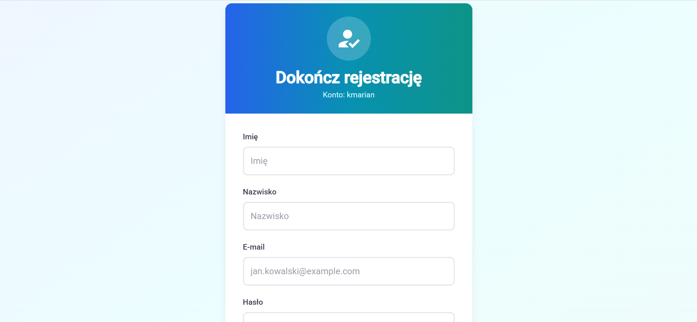

3. Uzupełnij:
    - **Imię**
    - **Nazwisko**
    - **Adres e-mail**: musi być unikalny w systemie (nikt inny nie może mieć takiego samego e-maila). Będzie potrzebny m.in. do tego, żeby inni domownicy mogli zaprosić Cię do swojego gospodarstwa.
    - **Hasło**: musi mieć od 8 do 20 znaków **i zawierać co najmniej jeden znak specjalny** (np. `!`, `@`, `#`, `%`, `-`). Samo hasło alfanumeryczne (tylko litery i cyfry) nie zostanie zaakceptowane.
    - **Potwierdź hasło**: musi być identyczne z polem powyżej.
4. Kliknij **"Utwórz konto"**.

Jeśli wszystko się zgadza, zostaniesz od razu zalogowany/a i przeniesiony/a do aplikacji, na ekran **Profil** (bo na tym etapie nie należysz jeszcze do żadnego gospodarstwa domowego, więcej o tym w sekcji 5).

**Co może pójść nie tak na tym etapie:**
- *"Ten link jest nieprawidłowy, wygasł albo został już wykorzystany"*: link stracił ważność (minęło 48h) albo ktoś już go użył (np. Ty sam/a wcześniej). Poproś administratora o nowy.
- *"Hasła nie są identyczne"*: literówka w jednym z dwóch pól hasła.
- Komunikat o znaku specjalnym: dodaj do hasła np. `!` albo `_`.

---

## 3. Logowanie

Gdy masz już założone konto, kolejne logowania wyglądają tak:

1. Wejdź na stronę logowania aplikacji.
2. Wpisz **nazwę użytkownika** i **hasło**.
3. Kliknij **"Zaloguj się"**.

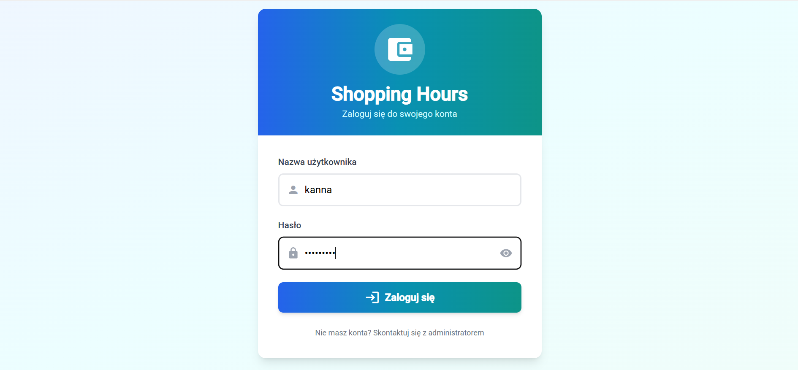

Jeśli masz włączoną weryfikację dwuetapową (2FA, opisaną dokładnie w sekcji 12), po poprawnym haśle zobaczysz dodatkowy krok proszący o 6-cyfrowy kod z aplikacji uwierzytelniającej.

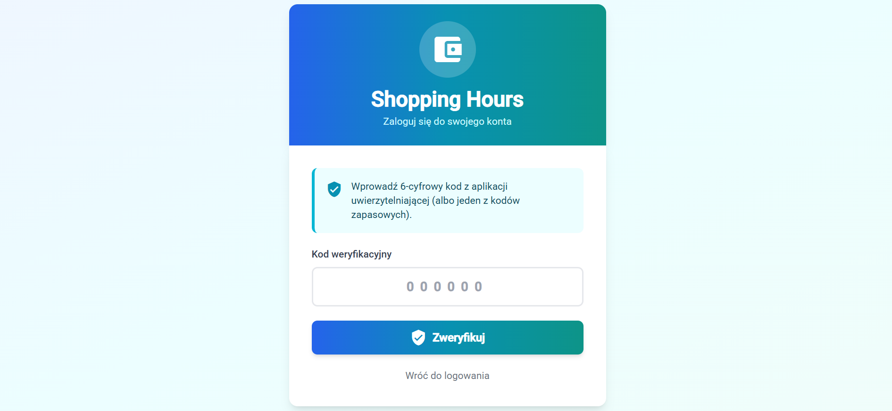

Jeśli podasz złe hasło, zobaczysz komunikat "Nieprawidłowa nazwa użytkownika lub hasło". Spróbuj ponownie.

---

## 4. Poznaj interfejs aplikacji

Po zalogowaniu zobaczysz główny układ aplikacji:

- **Górny pasek nawigacji**: na urządzeniach mobilnych/węższych ekranach kliknięcie w ikonę menu otwiera panel boczny.
- **Menu boczne (lewa strona)**: główna nawigacja po aplikacji, zawiera zakładki:
    - **Panel główny**: miesięczne podsumowanie wydatków, budżetu, przychodów i bilansu (sekcja 12),
    - **Wydatki**: pełna lista, dodawanie, edycja (sekcja 9),
    - **Kategorie**: drzewo kategorii wydatków (sekcja 8),
    - **Budżet**: limity wydatków dla gospodarstwa i kategorii (sekcja 10),
    - **Przychody**: (dowolne) rejestrowanie dochodów gospodarstwa (sekcja 11),
    - **Gospodarstwa**: zarządzanie gospodarstwami, do których należysz (sekcja 5),
    - **Zaproś użytkownika**: widoczne **tylko dla administratorów systemu** (sekcja 16).
    - Na samym dole: **Wyloguj**.

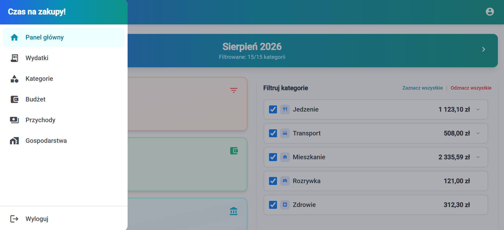

Ważna zasada w całej aplikacji: **prawie wszystko, co robisz (wydatki, kategorie), dotyczy Twojego aktualnie wybranego gospodarstwa domowego.** Jeśli należysz do kilku gospodarstw, musisz wiedzieć, które jest w danym momencie "aktywne", o przełączaniu między nimi przeczytasz w następnej sekcji.

---

## 5. Gospodarstwa domowe: najważniejsza koncepcja

### Czym jest "gospodarstwo domowe" w tej aplikacji

Gospodarstwo domowe (ang. *household*) to przestrzeń, w której gromadzicie wspólne wydatki, np. "Dom", "Mieszkanie na Mokotowie", "Wyjazd nad morze z przyjaciółmi". Każde gospodarstwo ma:
- własną, niezależną listę kategorii wydatków,
- własną listę wydatków,
- własną listę członków (domowników), z przypisanymi rolami.

Możesz należeć jednocześnie do **maksymalnie 5 gospodarstw** (np. własny dom + wspólne rozliczenia z rodzicami + wyjazd grupowy). W danym momencie tylko jedno z nich jest Twoim **bieżącym gospodarstwem**, to ono decyduje, jakie kategorie i wydatki widzisz na co dzień.

### Jeśli nie należysz jeszcze do żadnego gospodarstwa

Jeśli właśnie założyłeś/aś konto, prawdopodobnie nie należysz jeszcze do żadnego gospodarstwa. Aplikacja automatycznie przekieruje Cię wtedy na ekran **Profil**, żebyś mógł/mogła:
- **utworzyć własne gospodarstwo**, albo
- **poczekać na zaproszenie** od kogoś innego (np. domownika, który już korzysta z aplikacji) i je zaakceptować.

### Tworzenie nowego gospodarstwa

1. Wejdź w zakładkę **Profil** albo **Gospodarstwa**.
2. Kliknij przycisk **"Utwórz nowe gospodarstwo"** / **"Dodaj gospodarstwo"**.

3. W oknie, które się otworzy, podaj:
    - **Nazwę** (2-50 znaków): musi być unikalna wśród **Twoich własnych** gospodarstw (dwie różne osoby mogą mieć gospodarstwo o tej samej nazwie, ale Ty sam/a nie możesz mieć dwóch o identycznej nazwie).
    - **Opis** (do 100 znaków).

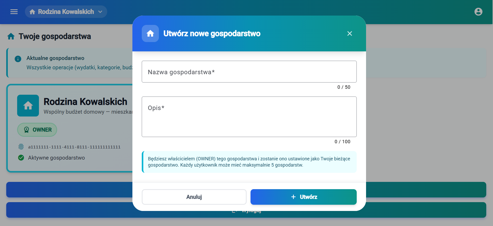

4. Kliknij **"Utwórz"**.

Po utworzeniu automatycznie:
- stajesz się **właścicielem (OWNER)** tego gospodarstwa (pełne uprawnienia, patrz sekcja 7),
- to gospodarstwo staje się Twoim **bieżącym gospodarstwem**.

### Przeglądanie swoich gospodarstw i przełączanie między nimi

Zarówno na ekranie **Profil**, jak i **Gospodarstwa**, zobaczysz kafelki wszystkich gospodarstw, do których należysz, z nazwą, opisem, Twoją rolą w danym gospodarstwie i odznaką pokazującą, czy jest ono aktualnie **"Bieżące"**.

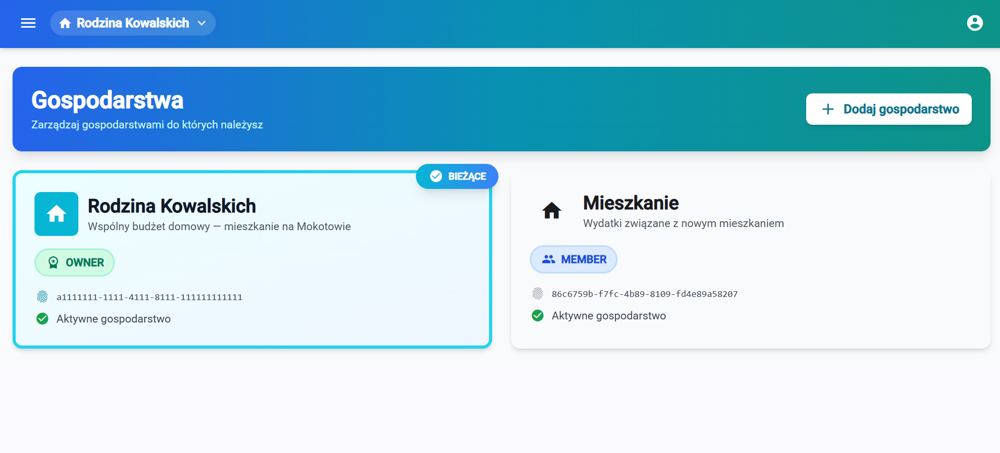

**Na ekranie Profil**: kliknięcie w kafelek innego (aktywnego) gospodarstwa **przełącza Cię na nie**. Od tego momentu wszystkie wydatki i kategorie, które widzisz w aplikacji, dotyczą tego nowo wybranego gospodarstwa.

**Na ekranie Gospodarstwa**: kliknięcie w kafelek **nie przełącza gospodarstwa**, tylko otwiera okno zarządzania nim (edycja nazwy, członkowie, zaproszenia, patrz sekcja 6).

---

## 6. Zapraszanie domowników i zarządzanie członkami

### Zapraszanie kogoś do gospodarstwa

Jeśli jesteś **właścicielem (OWNER)** gospodarstwa, możesz zapraszać do niego inne osoby, ale **tylko takie, które już mają konto w aplikacji** (patrz sekcja 16, konta zakłada administrator).

1. Wejdź w zakładkę **Gospodarstwa**, kliknij kafelek gospodarstwa, którym zarządzasz.
2. W sekcji **"Zaproś nowego członka"** wpisz **adres e-mail** osoby, którą chcesz zaprosić, oraz wybierz jej **rolę** (Member albo Guest, wyjaśnienie ról w sekcji 7).

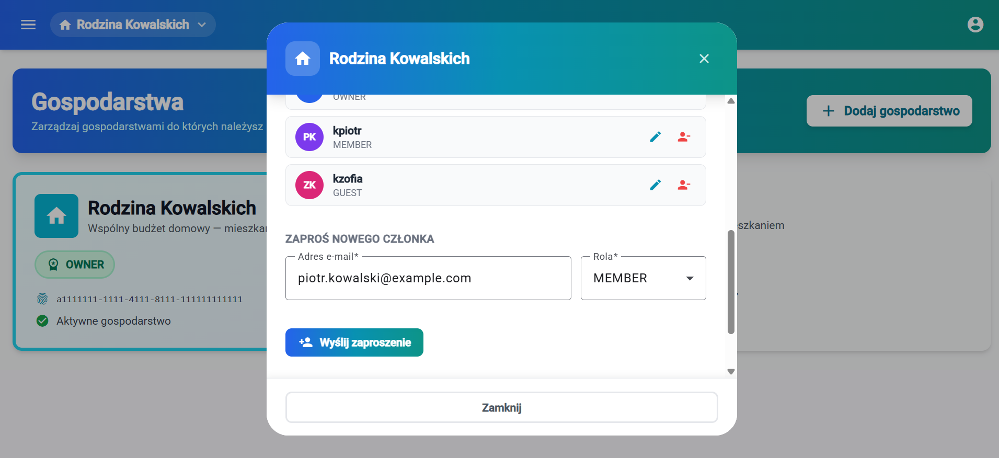

3. Kliknij **"Wyślij zaproszenie"**.

Zawsze zobaczysz ten sam komunikat: *"Jeśli taki użytkownik istnieje i spełnia warunki, otrzyma zaproszenie do gospodarstwa"*. To celowe zachowanie ze względów bezpieczeństwa (aplikacja nigdy nie zdradza, czy dany e-mail w ogóle istnieje w systemie, czy dana osoba jest już członkiem, czy ma już zbyt wiele gospodarstw itd.).

### Akceptowanie lub odrzucanie zaproszenia

Jeśli ktoś zaprosił Cię do swojego gospodarstwa, zobaczysz to jako **żółty baner z powiadomieniem** na górze ekranów **Profil** i **Gospodarstwa**.

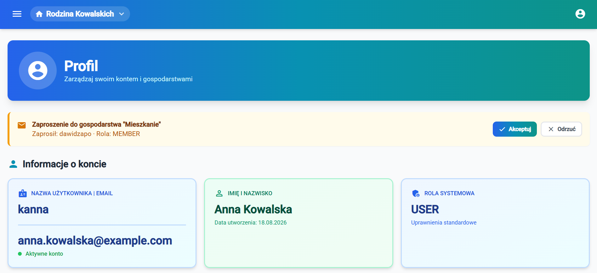

- **Akceptuj**: dołączasz do gospodarstwa z rolą, którą przypisał zapraszający. Jeśli nie miałeś/aś jeszcze żadnego bieżącego gospodarstwa, to nowe automatycznie nim zostaje.
- **Odrzuć**: zaproszenie znika, nic się nie dzieje.

Uwaga: nie da się zaakceptować zaproszenia, jeśli należysz już do 5 gospodarstw, musisz najpierw opuścić/zostać usuniętym z jednego z obecnych.

### Zarządzanie listą członków

W oknie szczegółów gospodarstwa (dostępnym tylko dla właściciela) widzisz pełną listę członków wraz z ich rolami.

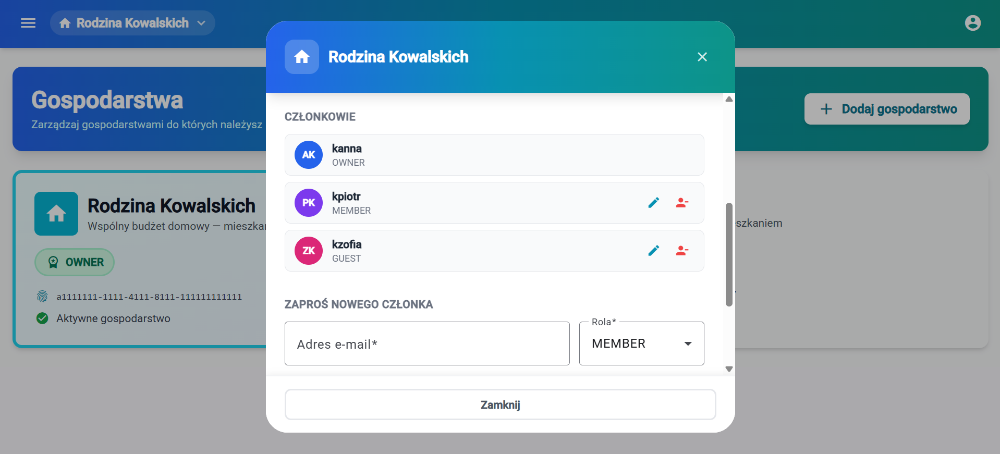

Przy każdym członku (poza Tobą samym/samą) właściciel ma dwie ikony:
- **✏️ Edytuj rolę**: otwiera okno zmiany roli tej osoby (patrz niżej).
- **🗑️ Usuń**: usuwa tę osobę z gospodarstwa (po potwierdzeniu). Jeśli to gospodarstwo było jej bieżącym, po usunięciu przestaje nim być.

### Zmiana roli członka

1. Kliknij ikonę edycji przy wybranym członku.
2. Wybierz nową rolę: **OWNER**, **MEMBER** lub **GUEST**.

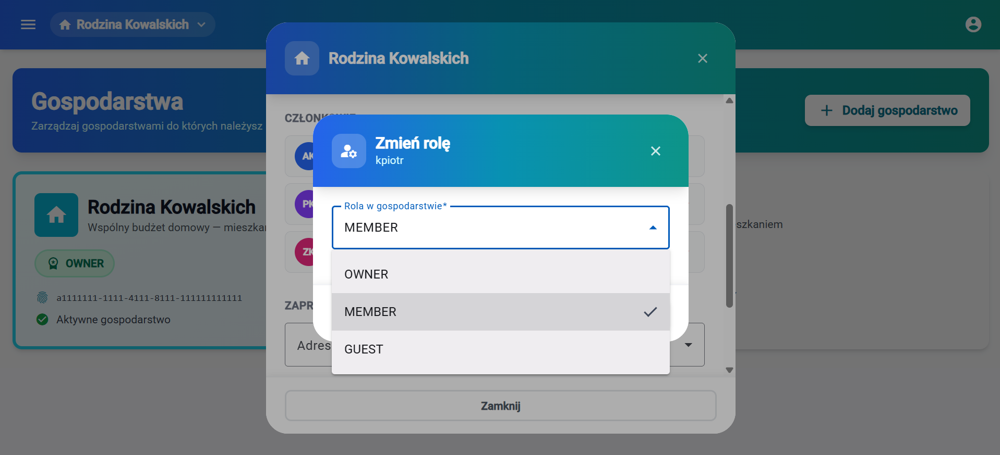

3. Jeśli wybierzesz **OWNER**, zobaczysz wyraźne ostrzeżenie: nadanie tej roli daje danej osobie **pełną kontrolę** nad gospodarstwem (może robić dosłownie wszystko, łącznie z zarządzaniem innymi właścicielami). Gospodarstwo może mieć **więcej niż jednego właściciela** jednocześnie.

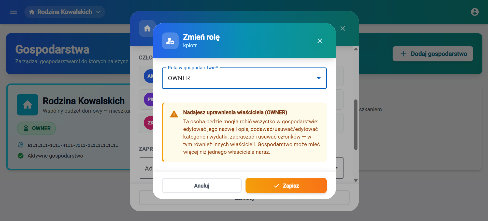

4. Kliknij **"Zapisz"**.

Uwaga: nie możesz zmienić **własnej** roli. To zabezpieczenie przed przypadkowym odebraniem sobie uprawnień.

---

## 7. Role w gospodarstwie: kto co może robić

W każdym gospodarstwie masz przypisaną jedną z trzech ról:

| Rola | Wydatki (dodaj/edytuj/usuń) | Przychody (dodaj/edytuj/usuń) | Kategorie (dodaj/edytuj/usuń) | Budżety (dodaj/edytuj/usuń) | Źródła przychodu (dodaj/edytuj/usuń) | Zarządzanie gospodarstwem i członkami |
|---|---|---|---|---|---|---|
| **OWNER** (właściciel) | ✅ | ✅ | ✅ | ✅ | ✅ | ✅ (edycja nazwy/opisu, zapraszanie, usuwanie/edycja ról członków, usunięcie gospodarstwa) |
| **MEMBER** (członek) | ✅ | ✅ | ❌ (tylko przeglądanie) | ❌ (tylko przeglądanie) | ❌ (tylko przeglądanie) | ❌ |
| **GUEST** (gość) | ❌ (tylko przeglądanie) | ❌ (tylko przeglądanie) | ❌ (tylko przeglądanie) | ❌ (tylko przeglądanie) | ❌ (tylko przeglądanie) | ❌ |

Kilka ważnych szczegółów:
- **Przeglądanie** (kategorie, wydatki, budżety, przychody, panel główny) jest dostępne dla **wszystkich** ról, łącznie z GUEST.
- **MEMBER** może dodawać, edytować i **usuwać dowolny** wydatek lub przychód w gospodarstwie, nie tylko własny.
- Gospodarstwo może mieć **wielu właścicieli** naraz.
- Jeśli w interfejsie nie widzisz jakiegoś przycisku (np. "Dodaj" przy wydatkach albo "+" przy kategoriach), to znak, że Twoja rola w bieżącym gospodarstwie na to nie pozwala.

---

## 8. Kategorie wydatków

Kategorie porządkują wydatki (np. "Jedzenie" → "Zakupy spożywcze" / "Restauracje"). Kategorie mogą mieć **podkategorie**, czyli tworzą drzewo, nie tylko płaską listę.

**Kto może zarządzać kategoriami:** tylko **OWNER** bieżącego gospodarstwa. Pozostałe role widzą kategorie, ale nie mogą ich zmieniać.

### Dodawanie kategorii

1. Wejdź w zakładkę **Kategorie**.
2. Kliknij **"+"** przy głównym poziomie drzewa (żeby dodać kategorię główną) albo przy istniejącej kategorii (żeby dodać jej podkategorię).

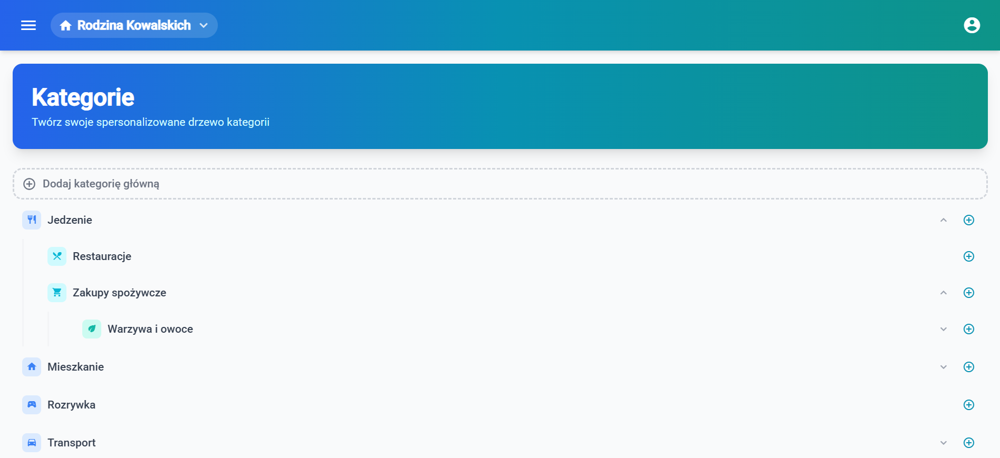

3. Podaj **nazwę** kategorii.
4. Wybierz **ikonę** z listy dostępnych ikon (możesz jej szukać po nazwie).

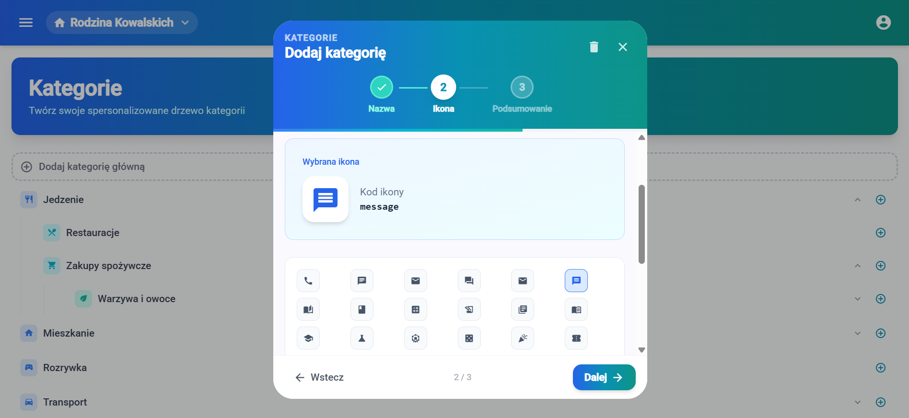

5. Sprawdź podsumowanie i zatwierdź.

### Edycja i usuwanie kategorii

Kliknij na istniejącą kategorię w drzewie, żeby otworzyć jej edycję, możesz zmienić nazwę i ikonę.

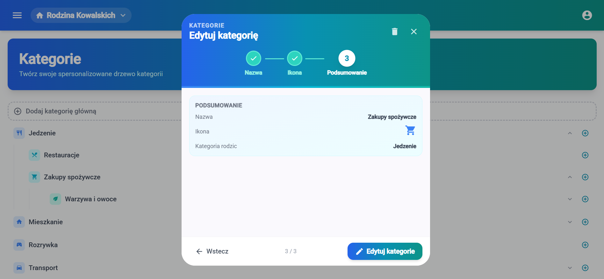

**Ważne przy usuwaniu:** usunięcie kategorii usuwa **też wszystkie jej podkategorie oraz wszystkie wydatki**, które były do niej (lub jej podkategorii) przypisane. Aplikacja pokaże Ci dokładną liczbę wydatków, które zostaną usunięte, zanim potwierdzisz. Przeczytaj to uważnie, ta operacja jest nieodwracalna.

---

## 9. Dodawanie i zarządzanie wydatkami

### Dodawanie wydatku

**Kto może:** OWNER i MEMBER (nie GUEST).

1. Wejdź w zakładkę **Wydatki**, kliknij **"Dodaj"**.

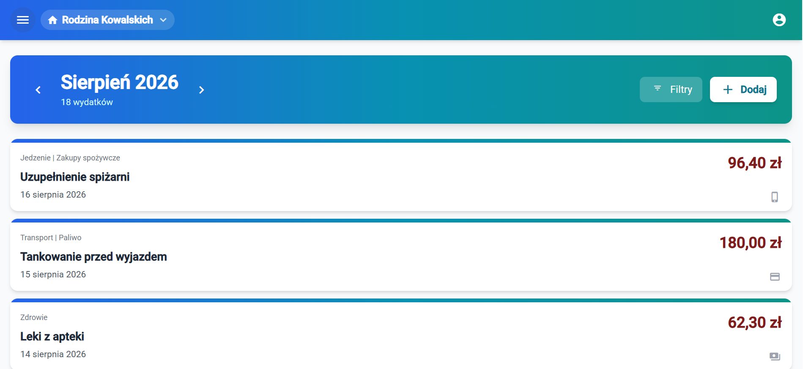

2. Formularz prowadzi Cię przez kilka kroków:
    - **Kategoria**: wybierz z drzewa kategorii swojego gospodarstwa.
    - **Kwota** i **data** wydatku.
    - **Opis** (do 50 znaków) oraz **metoda płatności**: Karta, Gotówka, Przelew albo BLIK.
    - **Członkowie**: zaznacz, kogo dotyczy ten wydatek (między kim ma być "podzielony"). Domyślnie możesz wybrać dowolnych aktualnych członków gospodarstwa.

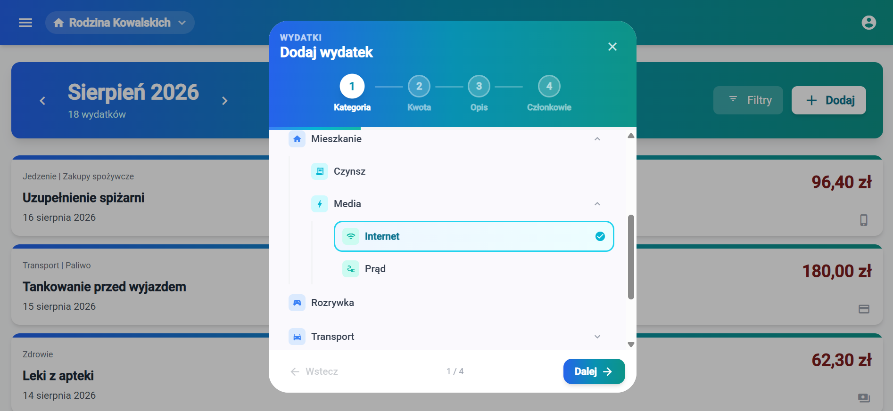
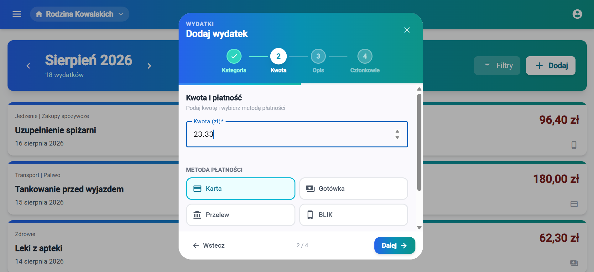
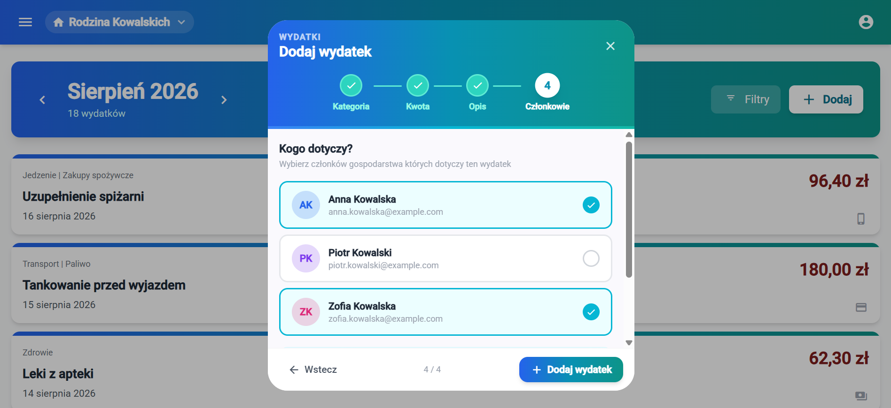

3. Sprawdź podsumowanie i zatwierdź.

### Przeglądanie i filtrowanie wydatków

Lista wydatków domyślnie pokazuje bieżący miesiąc, strzałkami przy nagłówku możesz przechodzić między miesiącami.

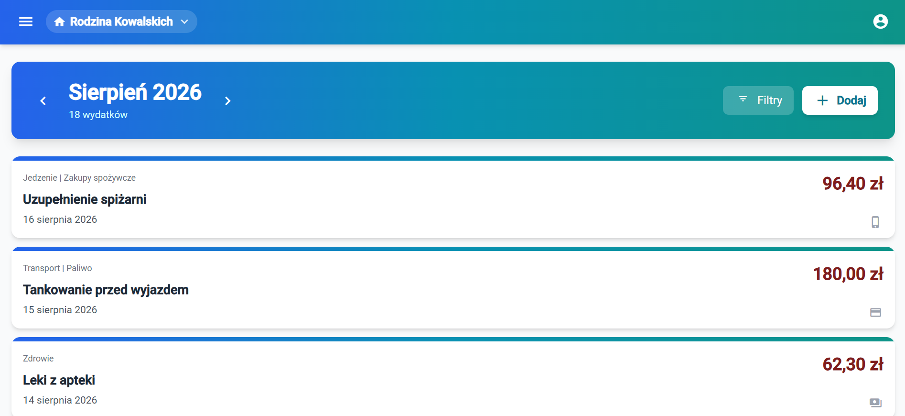

Przycisk **"Filtry"** pozwala zawęzić listę po: zakresie dat, kwocie, opisie, metodzie płatności, konkretnych kategoriach, konkretnych członkach oraz statusie "oczekujący".

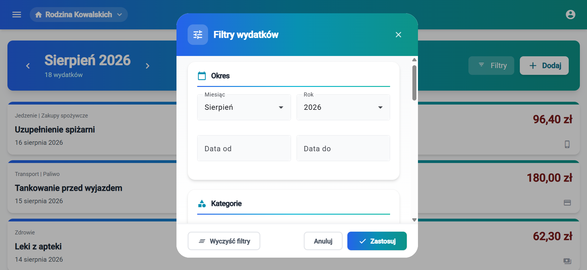

### Szczegóły, edycja i usuwanie wydatku

Kliknięcie w wydatek na liście otwiera okno szczegółów.

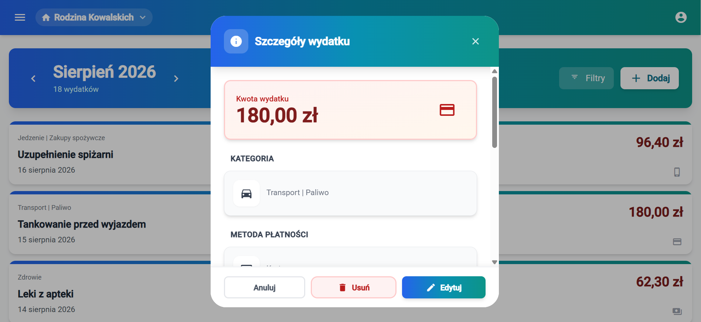

Jeśli masz odpowiednią rolę (OWNER/MEMBER), zobaczysz przyciski **"Edytuj"** i **"Usuń"**. GUEST widzi tylko szczegóły, bez możliwości zmian.

**Ważna informacja:** jeśli edytujesz wydatek, w którym uczestniczyła osoba **usunięta już z gospodarstwa**, nadal zobaczysz ją na liście wyboru członków, oznaczoną etykietą "Usunięty z gospodarstwa", żebyś świadomie zdecydował/a, czy zostawić ją w podziale, czy ją odznaczyć.

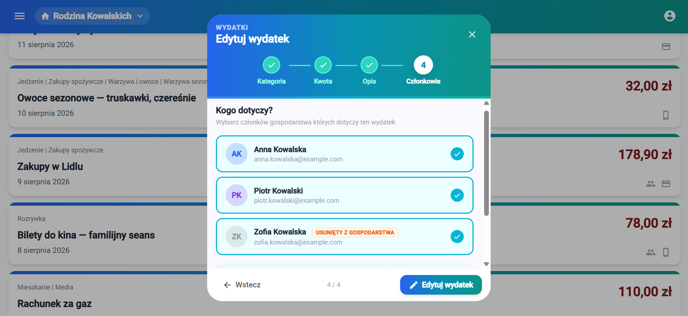

---

## 10. Budżetowanie

Budżet pozwala ustalić limit wydatków (dla całego gospodarstwa albo dla wybranej kategorii bądź podkategorii) i śledzić w zakładce **Budżet**, ile z niego zostało wykorzystane w danym miesiącu.

**Kto może zarządzać budżetami:** tylko **OWNER**. Pozostałe role widzą budżety i postęp ich wykorzystania, ale nie mogą ich zmieniać.

### Budżet domyślny a budżet na dany miesiąc

Każdy budżet (całego gospodarstwa albo kategorii) może być ustawiony na jeden z dwóch sposobów:
- **Domyślny**: powtarza się automatycznie co miesiąc, dopóki go nie zmienisz.
- **Tylko na bieżący miesiąc**: nadpisuje na ten jeden miesiąc budżet domyślny (przydatne np. gdy w danym miesiącu spodziewasz się większych wydatków w danej kategorii).

Budżet możesz ustawić na **dowolnym poziomie drzewa kategorii**: zarówno na kategorii głównej, jak i na dowolnej podkategorii, a także na poziomie całego gospodarstwa.

### Dodawanie budżetu

1. Wejdź w zakładkę **Budżet**, kliknij **"Dodaj budżet"**.

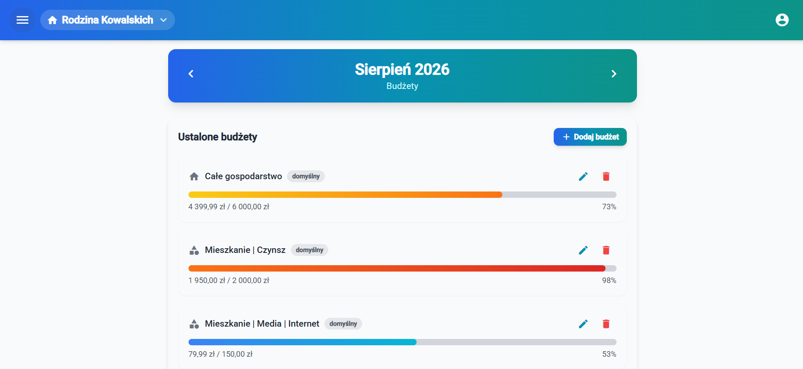

2. Wybierz zakres: **"Całe gospodarstwo"** albo konkretną kategorię/podkategorię z drzewa.

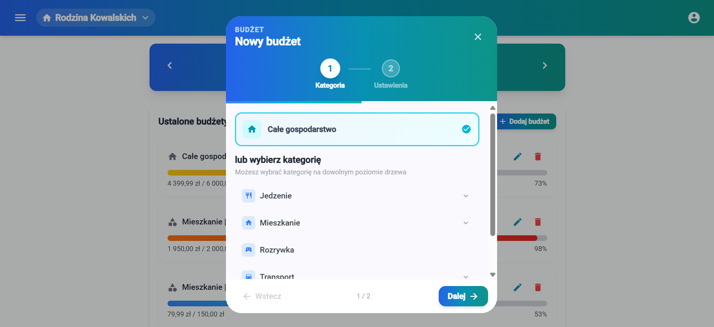

3. Wybierz, czy budżet ma być **domyślny** (powtarzalny co miesiąc), czy dotyczyć **tylko bieżącego miesiąca**, i podaj kwotę.

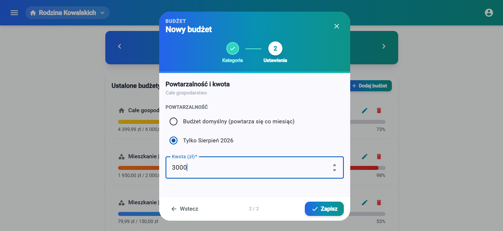

4. Zatwierdź.

### Budżet podkategorii nie może przekroczyć budżetu kategorii nadrzędnej

Jeśli dana kategoria (lub całe gospodarstwo) ma już ustalony budżet, suma budżetów jej bezpośrednich podkategorii **nie może go przekroczyć**. Przy próbie zapisu zbyt wysokiej kwoty aplikacja pokaże błąd z informacją, ile budżetu zostało jeszcze do rozdysponowania. Działa to też w drugą stronę: nie można zmniejszyć budżetu kategorii nadrzędnej poniżej sumy budżetów już ustalonych na jej podkategoriach.

Jeśli kategoria nadrzędna **nie ma jeszcze żadnego własnego budżetu**, jej podkategorie nie mają w tym zakresie żadnych ograniczeń.

### Podgląd wykorzystania budżetu

Na **panelu głównym** (sekcja 12) kafelek **"Pozostało"** jest klikalny, otwiera okno z listą wszystkich budżetów ustalonych na bieżący miesiąc, wraz z paskami postępu pokazującymi wykorzystanie każdego z nich. To samo, pełne zestawienie (z możliwością edycji i usuwania poszczególnych budżetów) znajdziesz bezpośrednio w zakładce **Budżet**.

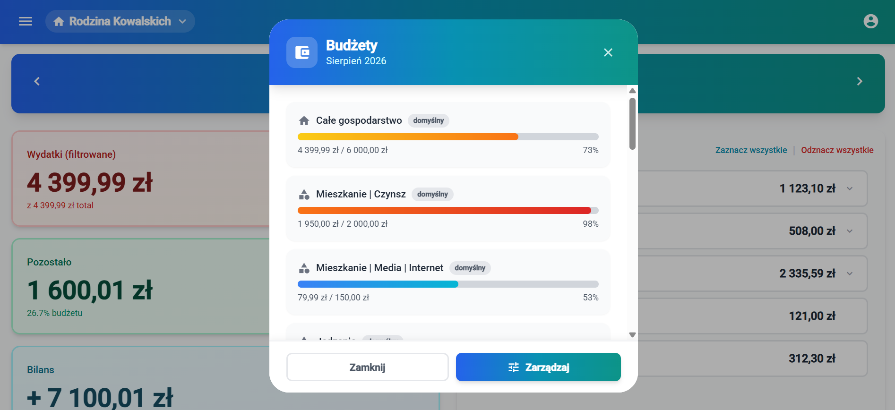

---

## 11. Przychody

Zakładka **Przychody** pozwala rejestrować dochody gospodarstwa (nie jest to obowiązkowe, aby aplikacja poprawnie działała): wypłaty, zlecenia i inne wpływy, niezależnie od wydatków.

**Kto może dodawać/edytować/usuwać przychody:** **OWNER** i **MEMBER**. **Kto może zarządzać źródłami przychodu** (patrz niżej): tylko **OWNER**. Przeglądanie listy przychodów jest dostępne dla wszystkich ról, łącznie z GUEST.

### Źródła przychodu

Źródło przychodu (np. nazwa pracodawcy, "Zlecenia", "Najem mieszkania") to opcjonalna kategoryzacja przychodu. Zarządzasz nimi z poziomu zakładki Przychody, przyciskiem **"Źródła"**: możesz dodawać nowe, zmieniać nazwę istniejących i usuwać niepotrzebne. Wskazanie źródła przy dodawaniu przychodu **nie jest wymagane**.

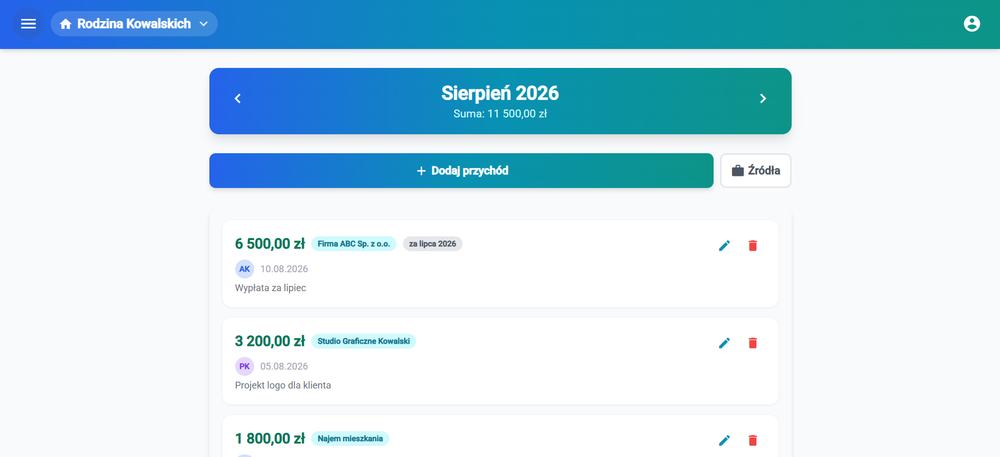

### Dodawanie przychodu

1. Wejdź w zakładkę **Przychody**, kliknij **"Dodaj przychód"**.
2. Podaj **kwotę**.
3. Wybierz **czyj to zarobek**: każdy przychód jest przypisany do konkretnego domownika, mimo że jest zapisany na poziomie całego gospodarstwa (widoczne jako kolorowy znaczek z inicjałami przy przychodzie na liście).

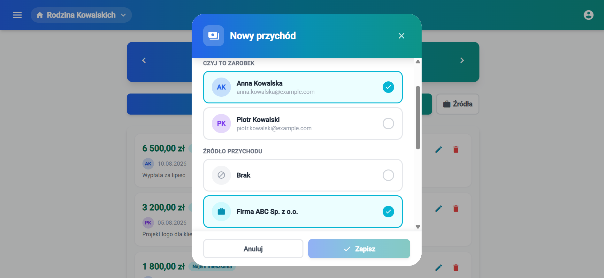

4. Wybierz **źródło** przychodu (opcjonalnie) spośród wcześniej zdefiniowanych.
5. Podaj **datę wpływu**: czyli kiedy pieniądze faktycznie pojawiły się na koncie. To ta data decyduje, w widoku którego miesiąca zobaczysz dany przychód.
6. Jeśli przychód dotyczy **innego miesiąca niż data wpływu** (np. wypłata za poprzedni miesiąc, którą dostajesz na początku kolejnego), zaznacz opcję **"Dotyczy innego miesiąca niż data wpływu"** i wskaż, którego miesiąca i roku dotyczy. To informacja dodatkowa, widoczna jako odznaka przy przychodzie, nie zmienia ona, w widoku którego miesiąca przychód się wyświetla (o tym zawsze decyduje data wpływu).

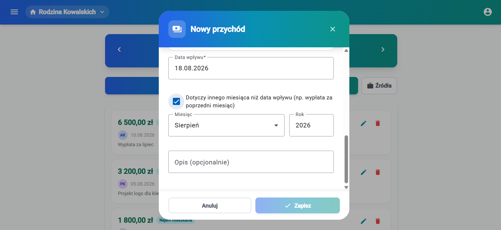

7. Opcjonalnie dodaj krótki opis i zatwierdź.

### Przeglądanie przychodów

Lista przychodów pokazuje miesięczną sumę u góry ekranu oraz nawigację strzałkami między miesiącami, tak samo jak w Wydatkach i Budżecie.

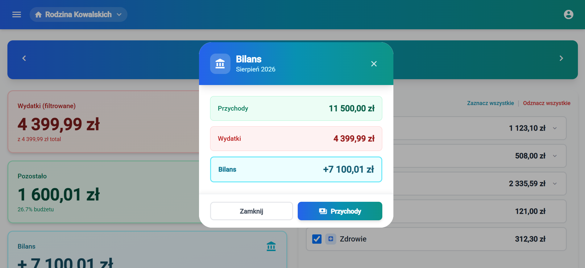

---

## 12. Panel główny (Dashboard)

Panel główny to szybkie podsumowanie finansowe bieżącego miesiąca dla Twojego aktualnego gospodarstwa.

Znajdziesz tu:
- **Sumę wydatków** w danym miesiącu (z uwzględnieniem ewentualnych filtrów kategorii),
- **Pozostały budżet** względem miesięcznego limitu: kafelek jest klikalny i otwiera pełny podgląd wszystkich budżetów na dany miesiąc (sekcja 10),
- **Bilans** miesiąca (przychody minus wydatki): ten kafelek pojawia się **tylko wtedy, gdy w danym miesiącu zarejestrowano choć jeden przychód**; kliknięcie otwiera zestawienie sumy przychodów, wydatków i bilansu, z linkiem do zakładki Przychody (sekcja 11),
- **Podział wydatków według kategorii**: możesz zawężać widok do wybranych kategorii,
- nawigację strzałkami do poprzednich/kolejnych miesięcy.

---

## 13. Profil użytkownika

Ekran **Profil** to Twoje centrum zarządzania kontem. Znajdziesz tu:

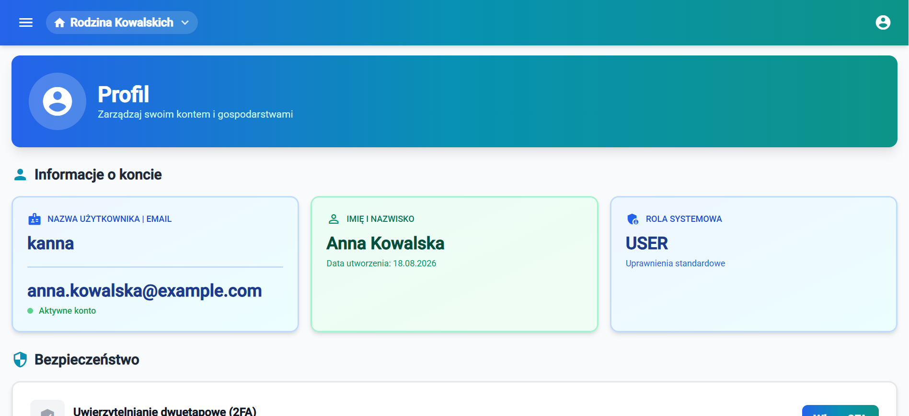

- **Dane konta**: nazwa użytkownika, e-mail, imię i nazwisko, rola systemowa, data utworzenia konta.
- **Bezpieczeństwo**: status weryfikacji dwuetapowej i przycisk jej włączenia/wyłączenia (sekcja 14).
- **Twoje gospodarstwa**: lista wszystkich gospodarstw, do których należysz, z możliwością przełączania (sekcja 5).
- Przycisk **"Utwórz nowe gospodarstwo"**.
- Przycisk **"Wyloguj"**.

---

## 14. Bezpieczeństwo konta: weryfikacja dwuetapowa (2FA)

Weryfikacja dwuetapowa (2FA) to dodatkowe zabezpieczenie logowania: oprócz hasła, przy logowaniu musisz podać też jednorazowy, 6-cyfrowy kod generowany przez aplikację na Twoim telefonie (np. Google Authenticator, Aegis, 1Password, Microsoft Authenticator). Zdecydowanie polecamy jej włączenie.

### Włączanie 2FA

1. Wejdź w **Profil** → sekcja **Bezpieczeństwo** → **"Włącz 2FA"**.

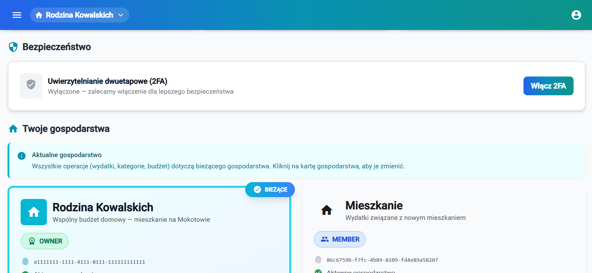

2. Zobaczysz **kod QR**. Zeskanuj go aplikacją uwierzytelniającą na telefonie (jeśli jeszcze jej nie masz, zainstaluj dowolną z wymienionych wyżej).

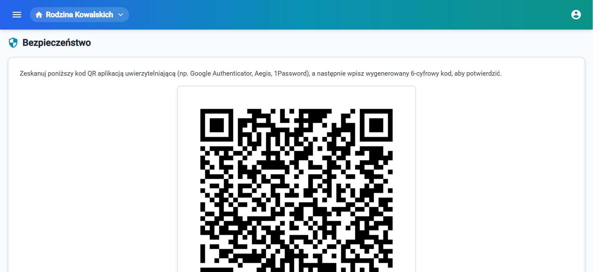

3. Aplikacja na telefonie zacznie generować 6-cyfrowe kody, zmieniające się co 30 sekund. Wpisz aktualny kod w polu na ekranie, żeby potwierdzić poprawne skonfigurowanie.
4. Po potwierdzeniu zobaczysz **listę kodów zapasowych** (backup codes): to jednorazowe kody ratunkowe, każdy może być użyty tylko raz, jeśli kiedyś stracisz dostęp do telefonu.

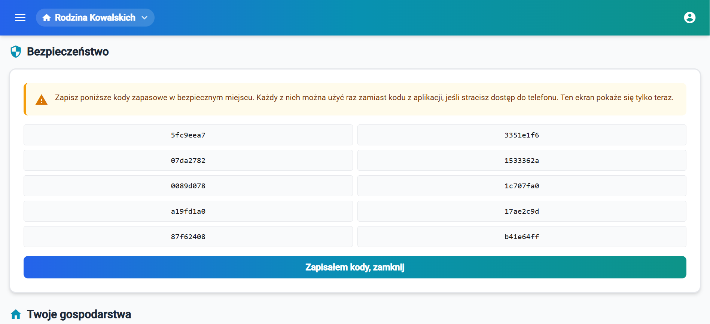

**Zapisz te kody w bezpiecznym miejscu już teraz**: ten ekran pokazuje się tylko raz i nie da się ich odzyskać później.

### Logowanie z włączonym 2FA

Po podaniu poprawnego hasła zobaczysz dodatkowy krok proszący o kod z aplikacji uwierzytelniającej (albo, w razie braku dostępu do telefonu, jeden z kodów zapasowych).

### Wyłączanie 2FA

W **Profil** → **Bezpieczeństwo** kliknij **"Wyłącz 2FA"** i potwierdź swoim hasłem.

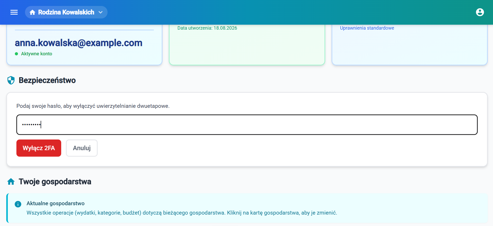

---

## 15. Usuwanie gospodarstwa

**Kto może:** tylko OWNER.

W oknie szczegółów gospodarstwa, na samym dole, znajduje się sekcja **"Strefa niebezpieczeństwa"** z przyciskiem **"Usuń gospodarstwo"**.

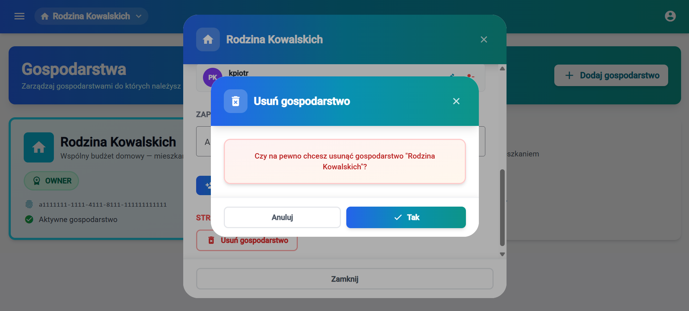

Po potwierdzeniu gospodarstwo **znika całkowicie** z widoku wszystkich jego członków, nie pojawi się już ani na ekranie Profil, ani Gospodarstwa, tak jakby zostało w pełni usunięte. Każdy, kto miał je jako bieżące gospodarstwo, straci tę przynależność i będzie musiał wybrać/przełączyć się na inne.

**To bardzo poważna operacja**: z perspektywy użytkownika jest nieodwracalna (aplikacja nie oferuje obecnie żadnej opcji przywracania usuniętego gospodarstwa). Upewnij się, że na pewno tego chcesz, zanim potwierdzisz.

---

## 17. Najczęstsze pytania (FAQ)

**Nie widzę przycisku "Dodaj"/"Usuń" przy wydatkach albo kategoriach, co się dzieje?**
Sprawdź swoją rolę w bieżącym gospodarstwie (Profil → Twoje gospodarstwa). Rola GUEST nie pozwala na żadne zmiany, MEMBER nie może zarządzać kategoriami, budżetami ani źródłami przychodu.

**Próbuję ustawić budżet, ale dostaję błąd, że przekracza budżet kategorii nadrzędnej, co robić?**
Suma budżetów podkategorii nie może przekroczyć budżetu ustalonego na kategorii nadrzędnej (ani całego gospodarstwa). Zmniejsz kwotę, zwiększ najpierw budżet kategorii nadrzędnej, albo usuń/zmniejsz budżety innych podkategorii, żeby zrobić miejsce.

**Dlaczego kafelek "Bilans" nie pojawia się na panelu głównym?**
Bilans pokazuje się dopiero, gdy w danym miesiącu zarejestrowano choć jeden przychód w zakładce Przychody.

**Chcę utworzyć drugie gospodarstwo o takiej samej nazwie jak to, które usunąłem, czy to możliwe?**
Tak. Usunięte (nieaktywne) gospodarstwa nie liczą się do sprawdzania unikalności nazwy ani do limitu 5 gospodarstw.

**Zgubiłem telefon z aplikacją do 2FA, co teraz?**
Użyj jednego z zapisanych wcześniej kodów zapasowych przy logowaniu zamiast 6-cyfrowego kodu z aplikacji. Jeśli nie masz zapisanych kodów zapasowych, skontaktuj się z administratorem.

**Nie mogę zaprosić kogoś do gospodarstwa, dostaję komunikat, że zaproszenie "może" zostać wysłane, ale nic się nie dzieje.**
To zamierzone działanie ze względów bezpieczeństwa, aplikacja nigdy nie potwierdza wprost, czy dany e-mail istnieje w systemie. Najczęstsze przyczyny braku zaproszenia: osoba nie ma jeszcze konta (musi je najpierw dostać od administratora), jest już członkiem tego gospodarstwa, ma już 5 gospodarstw, albo ma już wysłane, nieodebrane zaproszenie do tego samego gospodarstwa.

**Ile gospodarstw mogę mieć?**
Maksymalnie 5 (jako suma wszystkich, do których należysz, niezależnie czy jesteś właścicielem, członkiem czy gościem).

**Czy mogę zmienić własną rolę w gospodarstwie?**
Nie, nawet jako właściciel nie możesz zmienić własnej roli. Musi to zrobić inny właściciel tego gospodarstwa (jeśli taki istnieje).
